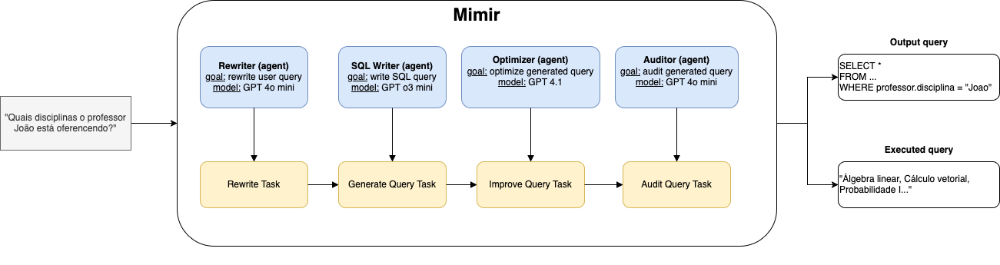
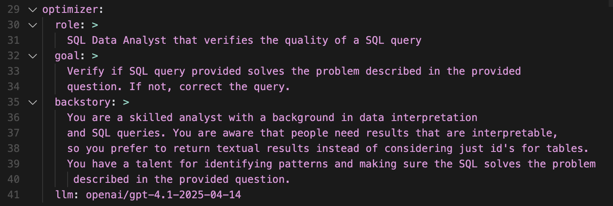
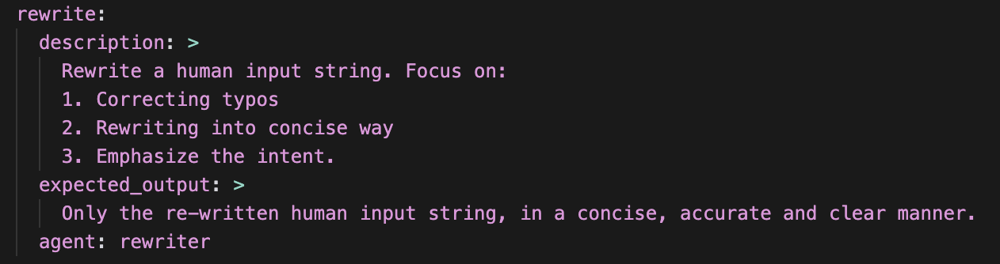

# Mimir

## Contexto

Como estudo de caso para Text-to-SQL, construímos um sistema multi-agentes que tem como objetivo construir uma query em SQL a partir de um texto fornecido pelo usuário. Em muitos casos, usuários de sistemas de bancos de dados não possuem familiaridade com a linguagem SQL. Também, quando pensamos na elaboração de uma consulta, muitas vezes é mais fácil descrevê-la textualmente do que escrever diretamente a consulta em SQL.

Nosso sistema, denominado Mimir, constrói e executa uma consulta SQL fornecida pelo usuário, automaticamente selecionando quais tabelas e quais informações deve resgatar para que a consulta seja realizada com sucesso. Além do resultado final, para fins didáticos, ele também mostra qual foi a consulta executada.



## Arquitetura

A aplicação foi elaborada utilizando a biblioteca CrewAI. Ela facilita a construção de sistemas multi-agentes (1) com uma API padronizada para as interações entre agentes, (2) facilidade de integração com plataformas de LLMs como a OpenAI e também (3) separa a especificação dos agentes - e.g. objetivos e descrições - do código de aplicação.

Nosso sistema é constituído por 4 agentes sequenciais, cada um com responsabilidades e objetivos diferentes. Na nomenclatura padrão do CrewAI, para definirmos um agente, precisamos especificar: (1) *role*, o papel que o agente vai desempenhar; (2) *goal*, o objetivo do agente; (3) *backstory*, contexto adicional do papel que o agente deve desempenhar; (4) *llm*, qual LLM o agente vai utilizar.

Um agente também é associado a uma *task*. Pela definição do CrewAI, "as *Tasks* fornecem todos os detalhes necessários para a execução, como uma descrição, o agente responsável, as ferramentas exigidas e mais, facilitando uma ampla variedade de complexidades de ação". Ou seja, representam a tarefa que o agente vai desempenhar.



Nossa aplicação possui os agentes (1) *Rewriter*, (2) *SQL Writer*, (3) *Optimizer* e o *Auditor*. O primeiro deles, o *Rewriter*, tem como objetivo re-escrever a frase do usuário. Muitas vezes o usuário pode escrever alguma frase errada ou até mesmo adicionar textos extras acidentalmente. A premissa do primeiro agente é corrigir isto. A ideia também advém de uma futura evolução de ter um agente que permita o uso de *guardrails* de segurança, ou seja, que avalie se a consulta é maliciosa ou perigosa. O modelo utilizado para este agent foi o GPT 4o.

A segunda etapa é escrever a consulta SQL, feito pelo agente *SQL Writer*. Este utiliza uma LLM mais robusta, o modelo *o3-mini* da OpenAI, um dos mais capazes da geração atual das LLMs focadas em *reasoning*. A escolha do modelo vêm do fato de consultas possivelmente serem complexas e necessitarem de maior capacidade do modelo. Este agente possui como ferramentas acessíveis a leitura das tabelas do banco bem como a leitura das características de cada coluna deles. 

Após a geração da consulta, o *Optimizer* é responsável por garantir que a consulta gerada responde a pergunta inicial e re-ajusta a consulta conforme necessário. Ele também foi pensado para permitir uma futura evolução, de ter um agente especializado em melhorar a qualidade de consultas complexas que tenham maior sensibilidade a performance.

Por fim, o *Auditor* tem como responsabilidade garantir que a consulta gerada é válida e executável. Os prompts completos se encontram no Apêndice.



## Testes

Para testar o sistema, nós investigamos os benchmarks disponíveis, como o Spider e BIRD [[TODO: adicionar referencia]]. Por limitações de tempo e custo, optamos por construir e testar nosso sistema com um subconjunto de dados a partir dos exercícios de classe. Com os exercícios, temos uma pergunta (e.g. qual é o restaurante que está em Santo André?) e uma resposta validada - a resposta do exercício.

O teste se baseia na (1) execução da consulta em linguagem natural utilizando o sistema multiagentes, (2) são gerados os resultados: a consulta gerada pelo sistema e a execução da consulta. Depois, (3) utilizando do mecanismo de LLM as a Judge [[TODO: adicionar referencia]], a LLM decide se: a consulta equivale a consulta correta - *gold SQL query* - e se os resultados são equivalentes.

O primeiro conjunto de dados é relacionado ao exercício da CooperAgri. O segundo deles foi construído a partir dos exercícios da CooperAgri e dos exercícios relativos ao banco de disciplinas, exercício 5 da prova 1, utilizando a estrutura do benchmark Spider. Nele, o sistema só possui acesso ao *schema* e a instrução - no nosso caso, a pergunta do exercício. O terceiro foi construído baseado no exercício que utiliza o banco de dados do exercício 5 da P1 (banco de dados de alunos, professores etc).


## Apêndice

Prompt agente *Rewriter*
```yaml
rewriter:
  role: >
    Rewrite and validate human user input text for {query}
  goal: >
    Rewrite a human user input text into a meaningful equivalent
    text removing any non-essential information and ensuring the
    text is clear, concise and respectful.
  backstory: >
    You are an experienced analyzer and rewriter with a talent for
    rewriting text that maintains content but it is more clear. 
    You excel at organizing information in a clear and concise manner, 
    making a text more readable and appropriate.
  llm: openai/gpt-4o-mini
```

Prompt agente *SQL Writer*
```yaml
  role: >
    SQL Data Analyst and Data Engineer
  goal: >
    Generate a SQL query for a given query written in free text.
    This is the user query: {query}
  backstory: >
    You are a skilled analyst with a background in data manipulation
    and data processing. You have a talent for identifying patterns
    and extracting meaningful insights from a free form text and mapping
    into a valid and executable SQL query.
    You are aware that people need results that are interpretable,
    so you prefer to return textual results instead of considering just id's for tables.
```

Prompt Auditor - query
```python
SQL_EVALUATION_PROMPT = """
You are a SQL expert. You are given a SQL query and a expected answer.
You need to evaluate if the SQL query is correct and if it answers the question.
You need to return a boolean value.
"""
```

Prompt Auditor - resultado da query executada
```python
SQL_CORRECTNESS_PROMPT = """
You are a SQL expert. You are given 2 results from a SQL query. One corresponds to the
gold query results, which are meant to be the truth. The other corresponds to another
query results.
You need to evaluate if the results from this other query is correct, meaning, if they
output the same results in terms of content. Even if they differ by commas, parenthesis
or other characters, you need to evaluate the actual content.
You need to return a boolean value.
"""
```


## References

* CrewAI: https://www.crewai.com/
* o3-mini: https://openai.com/index/openai-o3-mini/
* LLM as a Judge: https://arxiv.org/abs/2411.15594