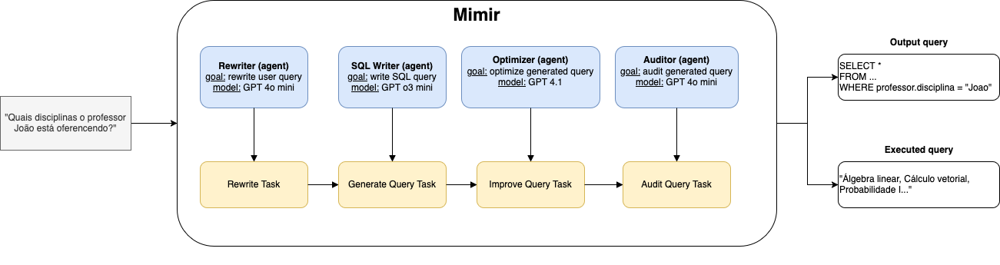
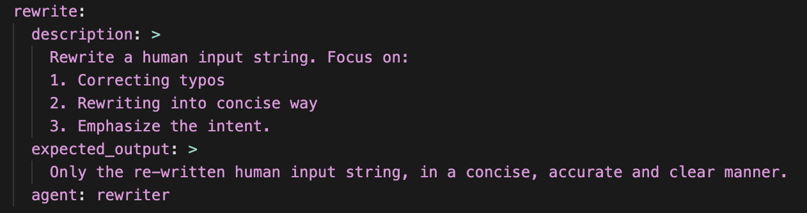

# Mimir

## Contexto

Como estudo de caso para Text-to-SQL, construímos um sistema multi-agentes que tem como objetivo construir uma query em SQL a partir de um texto fornecido pelo usuário. Em muitos casos, usuários de sistemas de bancos de dados não possuem familiaridade com a linguagem SQL. Também, quando pensamos na elaboração de uma consulta, muitas vezes é mais fácil descrevê-la textualmente do que escrever diretamente a consulta em SQL.

Nosso sistema, denominado Mimir, constrói e executa uma consulta SQL fornecida pelo usuário, automaticamente selecionando quais tabelas e quais informações deve resgatar para que a consulta seja realizada com sucesso. Além do resultado final, para fins didáticos, ele também mostra qual foi a consulta executada.

## Arquitetura

A aplicação foi elaborada utilizando a biblioteca CrewAI. Ela facilita a construção de sistemas multi-agentes (1) com uma API padronizada para as interações entre agentes, (2) facilidade de integração com plataformas de LLMs como a OpenAI e também (3) separa a especificação dos agentes - e.g. objetivos e descrições - do código de aplicação.

Nosso sistema é constituído por 4 agentes sequenciais, cada um com responsabilidades e objetivos diferentes. Na nomenclatura padrão do CrewAI, para definirmos um agente, precisamos especificar: (1) *role*, o papel que o agente vai desempenhar; (2) *goal*, o objetivo do agente; (3) *backstory*, contexto adicional do papel que o agente deve desempenhar; (4) *llm*, qual LLM o agente vai utilizar.

Um agente também é associado a uma *task*. Pela definição do CrewAI, "as *Tasks* fornecem todos os detalhes necessários para a execução, como uma descrição, o agente responsável, as ferramentas exigidas e mais, facilitando uma ampla variedade de complexidades de ação". Ou seja, representam a tarefa que o agente vai desempenhar.

Nossa aplicação possui os agentes (1) *Rewriter*, (2) *SQL Writer*, (3) *Optimizer* e o *Auditor*. O primeiro deles, o *Rewriter*, tem como objetivo re-escrever a frase do usuário. Muitas vezes o usuário pode escrever alguma frase errada ou até mesmo adicionar textos extras acidentalmente. A premissa do primeiro agente é corrigir isto. A segunda etapa é escrever a consulta SQL, feito pelo agente *SQL Writer*. Este utiliza uma LLM mais robusta, o modelo *o3-mini* da OpenAI, um dos mais capazes da geração atual das LLMs focadas em *reasoning*. A escolha do modelo vêm do fato de consultas possivelmente serem complexas e necessitarem de maior capacidade do modelo. Este agente possui como ferramentas acessíveis a leitura das tabelas do banco bem como a leitura das características de cada coluna deles. Após a geração da consulta, o *Optimizer* é responsável por garantir que a consulta gerada responde a pergunta inicial e re-ajusta a consulta conforme necessário. Por fim, o *Auditor* tem como responsabilidade garantir que a consulta gerada é válida e executável.

## Testes

Para testar o sistema, nós investigamos os benchmarks disponíveis, como o Spider e BIRD [[TODO: adicionar referencia]]. Por limitações de tempo e custo, optamos por construir e testar nosso sistema com um subconjunto de dados a partir dos exercícios de classe. O primeiro deles é relacionado ao exercício da CooperAgri. O segundo deles foi construído a partir dos exercícios da CooperAgri e dos exercícios relativos ao banco de disciplinas, exercício 5 da prova 1.

## References

* CrewAI: https://www.crewai.com/
* o3-mini: https://openai.com/index/openai-o3-mini/