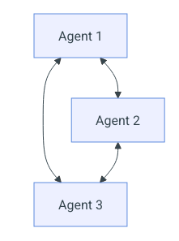
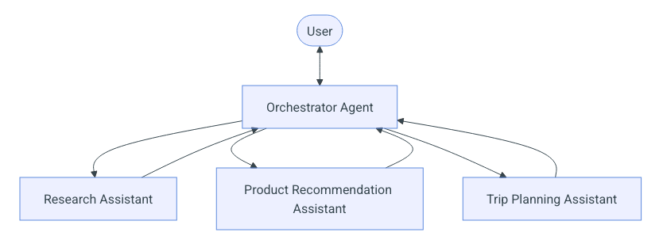

# Text-to-SQL with Multi-Agent Systems: Building Mimir

> This joint effort by myself, [Daniel Schulz](https://www.linkedin.com/in/daniel-schulz-msc/), [Guilherme Lee](https://www.linkedin.com/in/guilherme-narciso-lee-664247191/) and [Pedro Mendonça](https://www.linkedin.com/in/pedrohrm/) highlights the possibilities of multi-agent systems for Text-to-SQL.

In this blogpost, we will go through **Mimir**, an application built for as part of the MAC5861 - Database Modeling course at the University of São Paulo, demonstrating the practical application of multi-agent systems in real-world database scenarios.

Converting natural language queries to SQL is one of the most practical applications of AI in data science. This blog post presents a comprehensive tutorial and research analysis on building **Mimir**, a Text-to-SQL system using multi-agent architecture with CrewAI. We'll explore what Text-to-SQL is, dive into multi-agent systems, present our experimental methodology presented in the course, and provide a step-by-step implementation guide.


## Table of Contents

  - [Introduction](#introduction)
  - [What is Text-to-SQL?](#what-is-text-to-sql)
    - [Problem](#problem)
    - [Why Text-to-SQL Matters](#why-text-to-sql-matters)
    - [Challenges](#challenges)
  - [Building blocks](#building-blocks)
    - [Large Language Models (LLMs)](#large-language-models-llms)
    - [Multi-Agent Systems](#multi-agent-systems)
  - [Our Experiment: Mimir](#our-experiment-mimir)
  - [Step-by-Step Implementation](#step-by-step-implementation)
  - [Results](#results)
  - [Conclusions](#conclusions)

## Introduction

Efficient access to large volumes of structured data remains a challenge, especially for non-technical users. Text-to-SQL approaches aim to translate natural language questions into SQL queries, and recent advances in Large Language Models (LLMs) have improved their performance.

This blog post presents a investigation into multi-agent architectures in Text-to-SQL tasks. We developed **Mimir**, a system composed of four specialized agents using the CrewAI framework.

The results indicate that the multi-agent architecture achieves comparable accuracy to the single-agent model in manually audited queries, although at a higher computational cost.

### Research Question

Our main research question is: **Can multi-agent approaches outperform single-agent architectures in the task of generating SQL queries from natural language?**

## What is Text-to-SQL?

Text-to-SQL is the process of translating a question in natural human language into an SQL query. The approach must understand the semantic intention of the question, identify tables and columns, and perform aggregation and filtering operations.

In many cases, database users are not familiar with SQL syntax. When thinking about formulating a query, it's often easier to describe it textually than to write the SQL query directly. Our system, called **Mimir**, constructs and executes SQL queries from user input, automatically selecting which tables and information to retrieve for successful query execution.

Two important aspects of it:

1. **Democratization**: Makes database access available to non-technical users
2. **Applications**: Useful in conversational systems, data analysis tools, and database management systems

### Challenges in Text-to-SQL

- **Schema Understanding**: The system must understand database structure
- **Semantic Ambiguity**: Natural language can be ambiguous
- **Complex Queries**: Handling joins, aggregations, and nested queries
- **Multi-domain Complexity**: Different databases have different schemas and conventions
- **Predicate Ordering**: SQL predicate ordering in natural language
- **Performance Variation**: Depending on schema, annotation methods, and training data diversity

## Building blocks

### Large Language Models (LLMs)

Large Language Models are AI models capable of understanding and generating natural language. They use conditional probability distributions to predict the next word in a text sequence. These calculations are performed in neural networks based on the Transformer architecture, which relies on the attention mechanism introduced by Vaswani et al.

The advances introduced by the attention mechanism enabled the creation of models with a significantly larger number of parameters. This scalability is one of the main characteristics that differentiate LLMs from previous language models, allowing them to be trained with billions of parameters on vast amounts of textual data.

### Multi-Agent Systems

To improve LLM performance, various techniques and architectures have been explored, including chain-of-thought, prompt engineering, self-refinement, and ReAct (Reasoning and Acting). A complementary approach that has gained prominence is the use of multi-agent systems.

Multi-agent systems have shown promise in improving model factuality and reasoning capability compared to isolated model strategies. In this configuration, multiple model instances interact through proposals, mutual critiques, and refinements over several rounds, aiming to converge to a more reliable and accurate response.

#### Agentic interactions

Interactions between multiple agents can be classified into three main categories:

1. **Cooperative**: Agents collaborate to achieve a common goal
2. **Adversarial**: Each agent seeks to maximize its own benefit
3. **Mixed**: Combining elements of both approaches

We can also setup up our topology of agents in different ways:

1. **Sequential**: Agents work in sequence, each passing results to the next


2. **Mesh**: All agents can communicate with each other in a collaborative network



3. **Hierarchical**: One agent acts as orchestrator, delegating tasks to specialized agents



## Related Work

Early works in natural language to relational database translation were inspired by information retrieval (IR) techniques. Tools like DISCOVER, IR-style, and SPARK implemented keyword search mechanisms in relational databases.
Later advances sought to structure natural language interpretation through semantic parsing techniques. Systems like SQLizer and the work of Li and Jagadish illustrate this research line.

Machine learning-based models initiated a major breakthrough by replacing rigid heuristics with supervised techniques:

- **Seq2SQL**: One of the first to explore reinforcement learning for generating SQL queries
- **RAT-SQL**: Introduced relational encoding mechanism with contextualized attention
- **Spider and BIRD benchmarks**: Established evaluation standards for the field

### LLM Era

The evolution of Language Models for Text-to-SQL followed general advances in natural language processing. The Transformer architecture overcame limitations of previous models by adopting attention-centered approaches. Modern LLMs like GPT established fundamental principles: pre-training on massive corpora, fine-tuning with few examples, and purely auto-regressive architectures. This led to systems like ChatGPT and specialized models like SQLCoder.

### System Architecture


We chose CrewAI for building our multi-agent system because it provides a clear API which facilitates interactions. Besides, it is easy to setup for our purposes here.

### Agent Design

Our system consists of 4 sequential agents, each with different responsibilities and objectives. In CrewAI, to define an agent, we need to specify: (1) **role**, (2) **goal**, (3) **backstory**, (4) **llm**.

#### 1. Rewriter Agent
- **Role**: Text rewriter and validator for user queries
- **Goal**: Clean and clarify user input, removing non-essential information
- **Model**: GPT-4o-mini
- **Future Evolution**: Implement security guardrails to detect malicious queries

#### 2. SQL Writer Agent
- **Role**: SQL Data Analyst and Data Engineer
- **Goal**: Generate executable SQL queries from natural language
- **Model**: OpenAI o3-mini (chosen for advanced reasoning capabilities)
- **Tools**: Database table reading tools, column information access
- **Iterations**: Up to 5 attempts, with the last corresponding to the selected best solution

#### 3. Optimizer Agent
- **Role**: SQL Quality Assurance Specialist
- **Goal**: Verify queries answer the original question and improve them
- **Model**: OpenAI GPT 4.1
- **Future Evolution**: Specialize in complex query optimization for performance-sensitive scenarios

#### 4. Auditor Agent
- **Role**: SQL Syntax Validator
- **Goal**: Ensure SQL executability and validity
- **Model**: GPT-4o-mini
- **Responsibility**: Remove eventual indentation, punctuation, and other errors

## Experimental Methodology

### Datasets

Tests were performed with two small databases due to resource limitations and the high number of LLM calls caused by the multi-agent architecture:

1. **CooperAgri**: Four tables related to agricultural producers and consumer restaurants
2. **Students (Alunos)**: Four tables related to student enrollments in courses taught by professors

Both databases were extracted from examples built for the MAC5861 - Database Modeling course (2025, 1st semester). We used 27 natural language questions extracted from course exercise lists, with exercise answer keys in SQL queries adopted as gold standard (ground truth).

### Evaluation Metrics

Inspired by Spider 2.0-lite benchmark methodology and Katsogiannis-Meimarakis & Koutrika, we constructed two synthetic metrics:

1. **SQL Query Adequacy**: Boolean value evaluating if the generated query corresponds to the gold standard
2. **Response Adequacy**: Boolean value evaluating if the query response corresponds to the gold standard response

### Test Configuration

We proposed four tests for each natural language question:

1. **Multi-agent with schema and additional tools access**
2. **Multi-agent with schema access only**
3. **Simple agent with schema and additional tools access**  
4. **Simple agent with schema access only**

### Evaluation Methods

We performed evaluation through:
- **Manual auditing**: Adopted as ground truth
- **LLM-as-a-Judge**: Using GPT-3.5 Turbo for automated comparison

We executed 108 requests with 486 LLM calls, resulting in 16 scores.

## Implementation

Full implementation is here: 

We will do a quick walkthrough:

### Prerequisites

Before starting, ensure you have the following installed:

- Python 3.8 or higher
- PostgreSQL database
- Git (for cloning the repository)

We have a small README.md on how you can setup, but you should at least install the packages and create the tables below:

### Step 1: Environment Setup

```bash
# Create virtual environment
python -m venv text-to-sql-env
source text-to-sql-env/bin/activate

# Install required packages
pip install crewai
pip install fastapi
pip install uvicorn
pip install psycopg2-binary
pip install pandas
pip install python-dotenv
```

### Step 2: Database Setup

Create a PostgreSQL database and set up sample tables:

#### Students Database
```sql
CREATE TABLE students (
    id SERIAL PRIMARY KEY,
    name VARCHAR(100) NOT NULL,
    admission_date DATE NOT NULL,
    born_date DATE NOT NULL,
    program VARCHAR(50) NOT NULL,
    UNIQUE(name, admission_date, born_date, program)
);

-- Insert sample data
INSERT INTO students (name, admission_date, born_date, program) VALUES
('Anne Silva', '2020-01-01', '1994-03-01', 'Computer Science'),
('Jane Smith', '2020-01-02', '1998-10-23', 'Mathematics'),
('Mariana Lima', '2020-01-01', '1992-01-12', 'Physics'),
('Jim Carrey', '2020-01-02', '2000-01-05', 'Mathematics'),
('Kate McDonald', '2020-01-01', '2001-12-1', 'Computer Science');
```

#### CooperAgri Database
```sql
CREATE TABLE Agricultor(
    CodA integer PRIMARY KEY, 
    NomeA varchar(30) UNIQUE, 
    CidadeA varchar(20)
);

CREATE TABLE Produto(
    CodP integer PRIMARY KEY, 
    NomeP varchar(20) UNIQUE, 
    PrecoQuilo numeric(6,2)
);

CREATE TABLE Restaurante(
    CodR integer PRIMARY KEY, 
    NomeR varchar(20), 
    CidadeR varchar(20)
);

CREATE TABLE Entrega(
    CodA integer REFERENCES Agricultor(CodA), 
    CodP integer REFERENCES Produto(CodP), 
    CodR integer REFERENCES Restaurante(CodR),
    DataEntrega date, 
    QtdeQuilos integer,
    PRIMARY KEY (CodA, CodP, CodR)
);

-- Insert sample data
INSERT INTO Agricultor VALUES (1001, 'Ana Maria Machado', 'Mogi das Cruzes');
INSERT INTO Agricultor VALUES (1006, 'Lima Barreto', 'São Paulo');
INSERT INTO Produto VALUES (2001, 'tomate', 4.98);
INSERT INTO Produto VALUES (2002, 'batata', 0.98);
INSERT INTO Restaurante VALUES (3001, 'Brasileirinho', 'São Paulo');
INSERT INTO Restaurante VALUES (3002, 'Sabor de Minas', 'Santo André');
INSERT INTO Entrega VALUES (1001,2001,3002,'2017-05-05', 36);
```

### Step 3: Configure Environment Variables

Create a `.env` file in your project root:

```bash
# OpenAI API Configuration
OPENAI_API_KEY=your_openai_api_key_here

# Database Configuration
DB_HOST=localhost
DB_NAME=your_database_name
DB_USER=your_username
DB_PASSWORD=your_password
```

### Step 4: Agent Configuration

Create `config/agents.yaml` with the exact specifications from our Mimir system. You can find them at: TODO

A sample of what it looks like:

```yaml
sql_writer:
  role: >
    SQL Data Analyst and Data Engineer
  goal: >
    Generate a SQL query for a given query written in free text.
    This is the user query: {query}
  backstory: >
    You are a skilled analyst with a background in data manipulation
    and data processing. You have a talent for identifying patterns
    and extracting meaningful insights from a free form text and mapping
    into a valid and executable SQL query.
    You are aware that people need results that are interpretable,
    so you prefer to return textual results instead of considering just id's for tables.
  llm: openai/o3-mini-2025-01-31
```

### Step 5: Task Configuration

Create `config/tasks.yaml`. You can see all tasks here: TODO

Here is a sample of it:

```yaml
generate_query:
  description: >
    Generate a SQL query based on the user input. Focus on:
    1. Retrieving relevant data
    2. Filtering and sorting the data
    3. Limiting the number of results, if necessary
    4. Formatting the query in a way that is easy to understand and execute
    5. Select the appropriate tables to add to the query

    To accomplish your task, you need to:
    1. You need to identify the available tables.
    2. You need to identify each tables schema.

    Make sure to generate a query that is optimized and executable. Give preference
    to textual results instead of considering just id's for tables.
  expected_output: >
    A SQL query that retrieves and processes data based on the user input.
    The query should be optimized and executable. The query should use only
    the available tables and columns. It will be used directly to query a database.
    Output should be enclosed on <sql> tags (e.g. <sql>SELECT *...</sql>). 
  agent: sql_writer
```

### Step 6: Database Tools

Create `tools/custom_tools.py`. The full file is here: TODO

This part is basically annotating the functions that are going to be used as tools. For example, this what you might do to read the tables in the database:

```python
# Imports here
...

# Database connection
CONNECTION = psycopg2.connect(
    host=os.getenv('DB_HOST', 'localhost'),
    database=os.getenv('DB_NAME'),
    user=os.getenv('DB_USER'),
    password=os.getenv('DB_PASSWORD')
)

def _read_table_list():
    logger.info('Reading table list...')
    with CONNECTION.cursor() as cur:
        cur.execute("""
            SELECT table_name
            FROM information_schema.tables
            WHERE table_schema = 'public'
              AND table_type = 'BASE TABLE'
        """)
        fetched_results = cur.fetchall()
        logger.info(f'Table list read. Results = {fetched_results}')
        return fetched_results
```

### Step 7: Create the Multi-Agent Crew

Here is where you actually setup your Crew and how it is going to configured. Here's a `crew.py` based on our actual implementation. You can see that we set up a `@agent`, `@task` and the crew itself with `@crew`:

```python
# Imports
...

@CrewBase
class SQLCrew():

    @agent
    def sql_writer(self) -> Agent:
        return Agent(
            config=self.agents_config['sql_writer'],
            verbose=False,
            max_iter=5,
            tools=[read_tables_list_tool, read_table_info_tool]
        )

    @task
    def generate_query_task(self) -> Task:
        return Task(
            config=self.tasks_config['generate_query'],
            max_retries=5,
        )

    @crew
    def crew(self) -> Crew:
        """Creates the SQL crew for Mimir"""
        return Crew(
            agents=self.agents,
            tasks=self.tasks,
            process=Process.sequential,
            verbose=False,
        )
```

### Step 9: FastAPI application

FastAPI is a high-performance Python web framework that automatically generates interactive API documentation and validates requests using type hints. The framework eliminates boilerplate code and reduces development time through automatic serialization, dependency injection, and built-in error handling.

```python
# Imports
...

class Query(BaseModel):
    query: str

...

@app.post("/api/search")
async def search(query: Query):
    ...

@app.get("/api/tables")
async def get_tables():
    """Get list of available tables"""
    tables = _read_table_list()
    return {"tables": parse_result(tables)}

...

if __name__ == "__main__":
    uvicorn.run(
        "app:app",
        host="0.0.0.0",
        port=8000,
        timeout_keep_alive=300,
        timeout_graceful_shutdown=300,
    )
```

## Experimental Results and Analysis

Our comprehensive evaluation revealed several important insights:

#### 1. Comparable Performance
The multi-agent architecture achieved performance comparable to single-agent models in manually audited queries, although at higher computational cost.

#### 2. Lexical vs. Logical Errors
Most discrepancies between expected and actual outputs were due to **lexical mismatches** rather than logical errors:
- **Singular/plural forms**: Query "Liste os códigos dos agricultores que já entregaram batatas" generated filters for "batatas" instead of "batata"
- **Language translation**: Portuguese-to-English translation issues
- **Special characters**: Problems with accented characters in table labels

#### 3. LLM-as-a-Judge Limitations
Automated LLM auditing yielded a high false negative rate:
- **SQL Query Evaluation Recall**: 56.8%
- **Response Evaluation Recall**: 76.1%
- This indicates that SQL query comparison is more difficult than result comparison

#### 4. Query Length Trends
We observed a tendency for LLMs to generate longer SQL queries with more columns than necessary, reinforcing the value of execution-based evaluation approaches.

### Cost-Benefit Analysis

- **Multi-agent cost**: Multiplied by number of agents (4x in our case)
- **Performance gain**: Minimal for low-complexity queries
- **Recommendation**: Single-agent for simple queries, multi-agent for complex scenarios

## Samples

Here are some samples natural language queries from our experiments:

### Example 1: CooperAgri Database
**Input (Portuguese)**: "Qual é o restaurante que está em Santo André?"
**Generated SQL**: 
```sql
SELECT NomeR 
FROM Restaurante 
WHERE CidadeR = 'Santo André';
```

### Example 2: Students Database
**Input**: "Show me all students in Computer Science program"
**Generated SQL**: 
```sql
SELECT name, admission_date, born_date 
FROM students 
WHERE program = 'Computer Science';
```

### Example 3: Complex Query with Lexical Issues
**Input**: "Liste os códigos dos agricultores que já entregaram batatas, mas nunca entregaram cebolas"
**Challenge**: System generated filters for "batatas" and "cebolas" (plural) instead of "batata" and "cebola" (singular as stored in database)

## Future Work

### 1. Extended Evaluation
A more definitive evaluation of multi-agent advantages would require:
- **Complex Benchmarks**: Full evaluation with Spider 2.0 and BIRD benchmarks
- **Higher Complexity Queries**: Test with queries requiring multiple tables and nested operations
- **Diverse Agent Roles**: Experiment with different agent configurations

### 2. Technical Improvements
- **Enhanced Prompt Engineering**: Utilize advanced prompt engineering techniques
- **Unified Model Usage**: Standardize on reasoning models like o3-mini across all agents
- **Alternative Topologies**: Test mesh and hierarchical multi-agent architectures

### 3. System Enhancements
- **Lexical Normalization**: Implement preprocessing to handle language variations
- **Security Features**: Develop the planned security guardrails in the Rewriter agent
- **Performance Optimization**: Specialize the Optimizer agent for complex scenarios

## Conclusions

Our research investigation into multi-agent Text-to-SQL systems reveals nuanced insights:

### Key Takeaways

1. **Context-Dependent Benefits**: Multi-agent systems show promise but benefits depend on query complexity
2. **Cost Considerations**: Higher computational costs must be weighed against performance gains
3. **Evaluation Challenges**: Automated evaluation using LLM-as-a-Judge has limitations
4. **Lexical vs. Logical**: Most errors are lexical rather than logical, suggesting areas for improvement

### When to Use Multi-Agent Systems

- **Complex Queries**: Multi-table joins, nested operations, complex aggregations
- **High-Stake Applications**: Where modularity and validation are critical
- **Extensible Systems**: When future expansion and specialization are planned

### When Single-Agent Suffices

- **Simple Queries**: Basic SELECT statements, single-table operations
- **Cost-Sensitive Applications**: Where computational cost is a primary concern
- **Rapid Prototyping**: For quick implementation and testing

Mimir demonstrates that while multi-agent systems offer modularity and extensibility advantages, their benefits become apparent primarily in complex scenarios. The choice between single-agent and multi-agent architectures should be guided by query complexity, cost constraints, and system requirements.

Our work contributes to the understanding of multi-agent systems in Text-to-SQL applications and provides a practical implementation guide for developers interested in this exciting intersection of natural language processing and database technology.

## Resources and References

1. **CrewAI Framework**: [https://www.crewai.com/](https://www.crewai.com/)
2. **OpenAI o3-mini**: [https://openai.com/index/openai-o3-mini/](https://openai.com/index/openai-o3-mini/)
3. **LLM as a Judge**: Zheng, L. et al. "Judging LLM-as-a-judge with MT-bench and Chatbot Arena." NeurIPS 2023.
4. **Spider Benchmark**: Yu, T. et al. "Spider: A large-scale human-labeled dataset for complex and cross-domain semantic parsing and text-to-SQL task." arXiv:1809.08887, 2018.
5. **Spider 2.0**: Lei, F. et al. "Spider 2.0: Evaluating language models on real-world enterprise text-to-sql workflows." arXiv:2411.07763, 2024.

- [FastAPI Documentation](https://fastapi.tiangolo.com/)
- [PostgreSQL Documentation](https://www.postgresql.org/docs/)

For the complete source code and additional examples, visit our GitHub repository or explore the `agents/query-rewriter/` directory in this project.

---